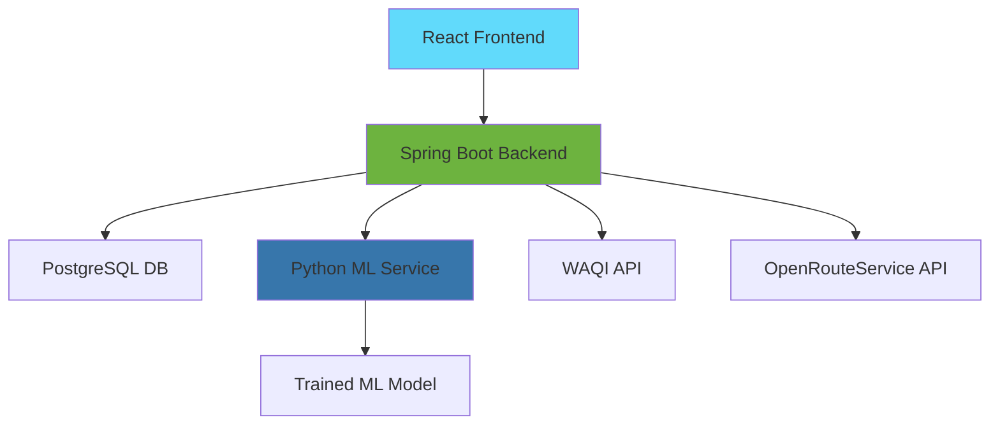

https://radiant-lily-55c610.netlify.app/
Of course. Here is a comprehensive, professional `README.md` file that integrates your Java Spring Boot backend, React frontend, and Python ML service into a single, cohesive project description.

---

# RouteAI – EcoTrack 🌿

**Health-Conscious Route Planning with AI Integration**

A full-stack web application that provides personalized, health-focused route recommendations. It combines real-time air quality data, user health profiles, and machine learning to calculate a **Health Safety Score** for navigation alternatives, helping users avoid pollution and disease hotspots.

> **🏆 Therap JavaFest Submission:** This project demonstrates mastery of Java/Spring Boot for the backend, React for the frontend, and Python for AI/ML services.

---

## ✨ Features

-   **Intelligent Routing:** Get multiple route alternatives scored on health factors, not just distance.
-   **Real-Time Environmental Data:** Integrates live Air Quality Index (AQI) from the WAQI API.
-   **Personalized Health Profiles:** Users specify health conditions (e.g., asthma, allergies) for tailored advice.
-   **Machine Learning Health Scoring:** A Python Flask microservice provides an enhanced AI-powered health score prediction.
-   **Interactive Map Visualization:** Built with React and Leaflet.js to display routes and environmental heatmaps.
-   **Secure JWT Authentication:** Full user registration and login system.
-   **Robust Fallback System:** The Java backend uses a rule-based scoring algorithm if the ML service is unavailable.

---

## 🏗️ System Architecture



---

## 🛠️ Technology Stack

### Backend (`/backend`)
-   **Java 17**
-   **Spring Boot 3.2** (Web, Security, Data JPA)
-   **Spring Security** with JWT Authentication
-   **PostgreSQL** with **PostGIS** extension
-   **Gradle** Build Tool

### Frontend (`/frontend`)
-   **React 18**
-   **React Router** (Navigation)
-   **Leaflet.js & React-Leaflet** (Maps)
-   **Tailwind CSS** (Styling)
-   **Axios** (API Client)

### AI/ML Service (`/ml-service`)
-   **Python 3.10+**
-   **Flask** (REST API)
-   **Scikit-learn, XGBoost, LightGBM** (ML Models)
-   **Joblib** (Model Persistence)

### APIs & Data Sources
-   **OpenRouteService API** (Route Geometry & Data)
-   **WAQI API** (Real-time Air Quality Data)

---


## ⚙️ Installation & Setup

### Prerequisites
-   **JDK 17**
-   **Node.js** (v18 or higher) + npm
-   **Python 3.10+** + pip
-   **PostgreSQL** (v12+) with PostGIS extension
-   **Git**

### 1. Clone the Repository
```bash
git clone <your-repo-url>
cd ecotrack
```

### 2. Database Setup
1.  Create a PostgreSQL database named `ecotrack`.
2.  Enable the PostGIS extension:
    ```sql
    CREATE EXTENSION postgis;
    ```

### 3. Backend Setup (Spring Boot)
```bash
cd backend

# Configure your application.properties file:
# - Set spring.datasource.url, username, and password
# - Add your API keys: aqicn.token and ors.api.key

# Run the application with Gradle
./gradlew bootRun
```
The backend server will start on `http://localhost:9090`.

### 4. Frontend Setup (React)
```bash
cd frontend

# Install dependencies
npm install

# Start the development server
npm run dev
```
The frontend will be available at `http://localhost:5173`.

### 5. ML Service Setup (Python Flask)
```bash
cd ml-service

# Create a virtual environment (recommended)
python -m venv venv
# On Windows: venv\Scripts\activate
# On macOS/Linux: source venv/bin/activate

# Install Python dependencies
pip install -r requirements.txt

# Run the Flask application
python app.py
```
The ML service will start on `http://localhost:5000`.

---

## 🔐 Configuration

### API Keys (Required)
You must obtain and configure the following API keys in `backend/src/main/resources/application.properties`:

```properties
# WAQI API for Air Quality Data
aqicn.token=your_waqi_api_key_here

# OpenRouteService API for Routing
ors.api.key=your_ors_api_key_here

# PostgreSQL Database
spring.datasource.url=jdbc:postgresql://localhost:5432/ecotrack
spring.datasource.username=your_db_user
spring.datasource.password=your_db_password
```

**How to get API keys:**
1.  **WAQI:** Sign up at [waqi.info](https://waqi.info/)
2.  **OpenRouteService:** Sign up at [openrouteservice.org](https://openrouteservice.org/)

### ML Service Connection
The Spring Boot backend is pre-configured to call the ML service. Ensure the Flask app is running on `http://localhost:5000`. The fallback mechanism will handle any connection issues gracefully.

---

## 🧠 Machine Learning Model

The `EnhancedHealthPredictor` class in `/ml-service` is responsible for the intelligent health scoring.

### Features Used for Prediction:
-   Real-time AQI value
-   Route distance and duration
-   Historical pollution data for the area
-   User health profile (sensitivity, conditions)
-   Time of day and weather data (optional)

### Training:
The model is a **Stacking Regressor** combining:
-   **Random Forest**
-   **Gradient Boosting (XGBoost, LightGBM)**
The model is trained on historical urban environmental data and saved as a `.pkl` file for the Flask app to load.

---

## 🚀 Deployment

### Backend (Spring Boot)
```bash
cd backend
# Create a production JAR
./gradlew build -x test

# Run the JAR
java -jar build/libs/ecotrack-0.0.1-SNAPSHOT.jar
```

### Frontend (React)
```bash
cd frontend
# Create a production build
npm run build

# Deploy the 'build' folder to a static host (Vercel, Netlify, S3)
```

### ML Service (Python)
For production, deploy the Flask app using a WSGI server like **Gunicorn**:
```bash
pip install gunicorn
gunicorn -w 4 -b 0.0.0.0:5000 app:app
```

Use a process manager like **PM2** to keep it running:
```bash
pm2 start --name "ml-service" "gunicorn -w 4 -b 0.0.0.0:5000 app:app"
```

---

## 📊 API Endpoints

| Method | Endpoint | Description |
| :--- | :--- | :--- |
| `POST` | `/api/auth/register` | User registration |
| `POST` | `/api/auth/login` | User login (returns JWT) |
| `GET` | `/api/route/recommend` | Get health-scored routes |
| `GET` | `/api/aqi` | Get AQI for a location |
| `POST` | `/api/profile` | Save user health profile |
| `POST` | `http://ml-service:5000/predict` | **(ML Service)** Get AI health score |

---

## 🧪 Testing the System

1.  **Start all services** (PostgreSQL, Spring Boot, React, Flask).
2.  **Open** `http://localhost:5173` in your browser.
3.  **Register** a new user account.
4.  **Set up** your health profile in the Profile section.
5.  **Go to the Map** page to generate recommended routes between two points.

---


## 📄 License

This project is created for educational and competition purposes. All rights reserved.
